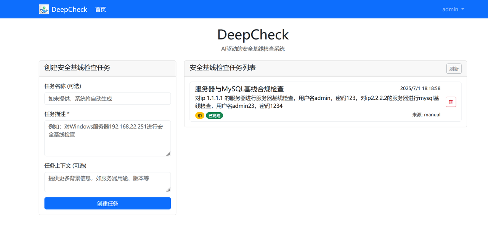
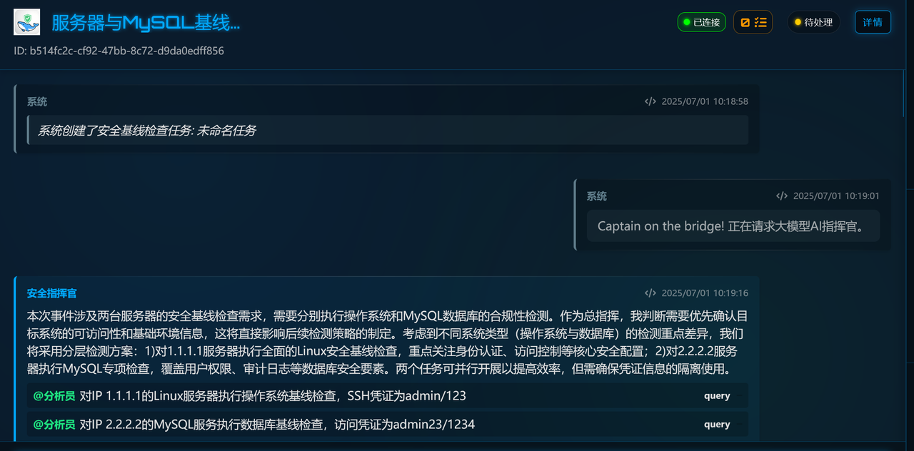

# DeepCheck 🚀

<p align="center">
  <strong>AI驱动的新一代基线合规检测平台</strong>
</p>


## 🚀 快速开始

### 环境要求

- Python 3.8+
- SQLite（试验阶段方便部署测试，成熟之后随时切换）
- inspec （docker环境）


### 安装步骤

1. 克隆项目
```bash
git clone https://github.com/aoao921/deepcheck.git
cd deepcheck
```

2. 安装依赖
```bash
virtualenv venv
source venv/bin/activate
# Windows
# .\venv\Scripts\activate
pip install -r requirements.txt
# pip install -r requirements.txt -i https://mirrors.aliyun.com/pypi/simple/ --trusted-host mirrors.aliyun.com 
# pip install -r requirements.txt -i https://mirrors.cloud.tencent.com/pypi/simple --trusted-host mirrors.cloud.tencent.com

```

3. 配置环境变量
```bash
cp sample.env .env
# 编辑 .env 文件，配置必要的环境变量
```
4. docker安装chef inspec
```bash
docker pull chef/inspec
```

5. 启动服务

为了方便管理，调试和优化改进，我们为每个角色启动了单独的进程。

```bash
# 初始化数据库
python main.py -init
# 首次初始化完成后，会创建admin/admin123的管理员账号
# 可以通过修改.env定义初始化账号/密码
```

```bash
# 使用单独的窗口，启动独立进程
# 启动前记得激活venv环境

# 主服务（Web、API）
python main.py
# 指挥官
python main.py -role _captain
# 安全管理员（经理）
python main.py -role _manager
# 安全工程师（操作员）
python main.py -role _operator
# 执行器
python main.py -role _executor
# 安全专家
python main.py -role _expert
```
### 一键启动所有服务

如果想在一个命令中启动全部服务，可以运行脚本：

```bash
python tools/run_all_agents.py
```

该脚本会自动从项目根目录加载`.env`文件，并在收到`Ctrl+C`或终止信号时清理所有子进程。
## 📚 使用示例

### Web界面创建检测事件

登录`http://127.0.0.1:55555/`  ,创建检测事件。



### 查看多Agent运行状态




## 🤝 参与贡献

我们欢迎任何形式的贡献！

1. Fork 本项目
2. 创建您的特性分支 (`git checkout -b feature/AmazingFeature`)
3. 提交您的改动 (`git commit -m 'Add some AmazingFeature'`)
4. 推送到分支 (`git push origin feature/AmazingFeature`)
5. 开启一个 Pull Request

## 📜 相关项目

- [inspec](https://github.com/inspec/inspec) - Auditing and Testing Framework 
- [deepsoc](https://github.com/flagify-com/deepsoc) - 通过多智能体（Multi-Agent）打造的革命性的安全运营解决方案